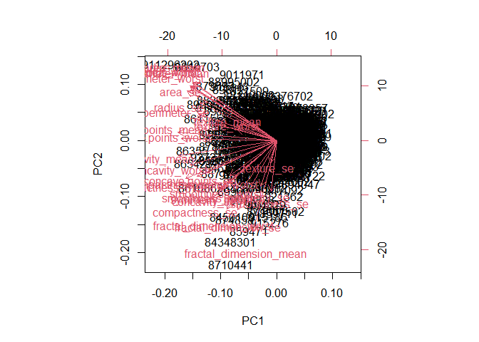
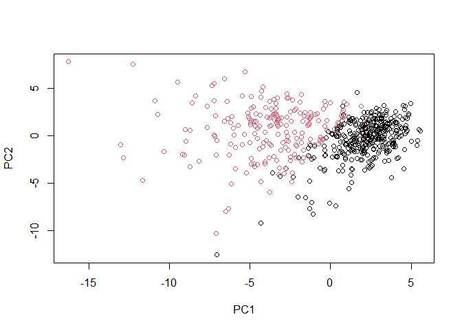
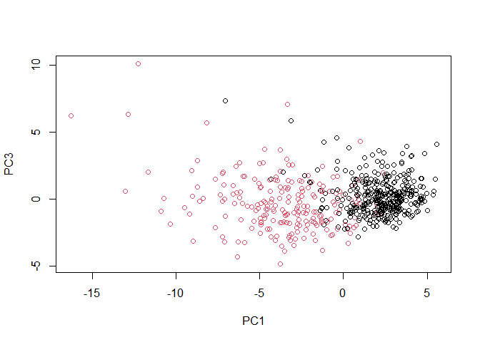
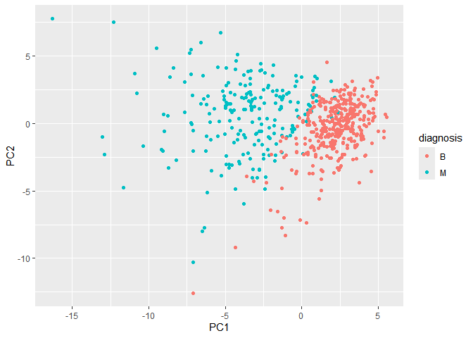
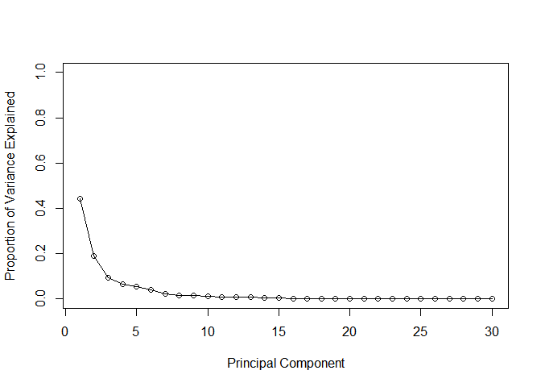
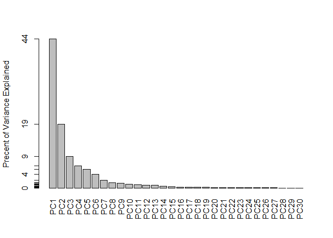
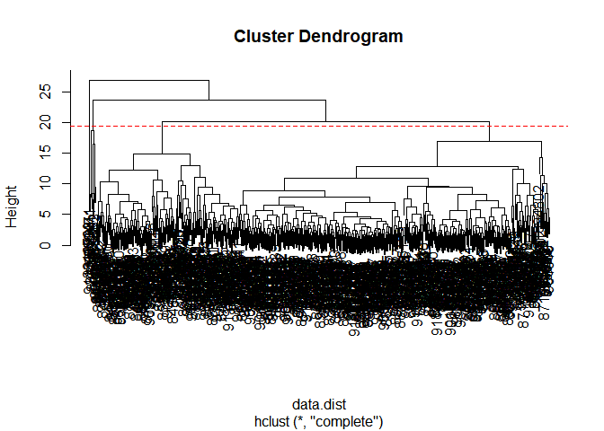
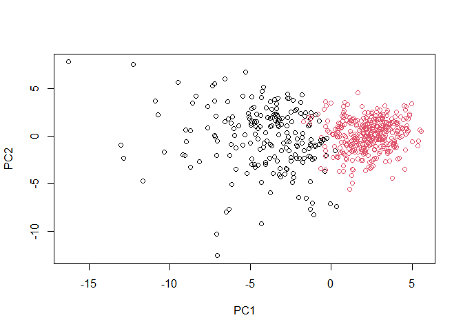

# Class 08: Breast Cancer Analysis mini project
Rachel Galleta (A16859649)

- [Background](#background)
- [Data Import](#data-import)
- [Principal Component Analysis](#principal-component-analysis)
- [Interpreting PCA results](#interpreting-pca-results)
- [Variance Explained](#variance-explained)
- [Comunicating PCA results.](#comunicating-pca-results)
- [Herarchical clustering](#herarchical-clustering)
- [Results Of hierarchical
  clustering](#results-of-hierarchical-clustering)
- [Selecting number of clusters](#selecting-number-of-clusters)
- [Using different methods](#using-different-methods)
- [Combinding methods (PCA and
  clustering)](#combinding-methods-pca-and-clustering)
- [Sensitivity/Specificity](#sensitivityspecificity)
- [Predictions](#predictions)

## Background

The goal of this mini-project is for you to explore a complete analysis
using the unsupervised learning techniques covered in class.

The data itself comes from the Wisconsin Breast Cancer Diagnostic Data
Set first reported by K. P. Benne and O. L. Mangasarian: “Robust Linear
Programming Discrimination of Two Linearly Inseparable Sets”.

Values in this data set describe characteristics of the cell nuclei
present in digitized images of a fine needle aspiration (FNA) of a
breast mass.

## Data Import

Data was dowloaded form the class website as a CVS file.

``` r
fna.data <- "WisconsinCancer.csv"
```

``` r
wisc.df <-read.csv("WisconsinCancer.csv", row.names=1)
head(wisc.df)
```

             diagnosis radius_mean texture_mean perimeter_mean area_mean
    842302           M       17.99        10.38         122.80    1001.0
    842517           M       20.57        17.77         132.90    1326.0
    84300903         M       19.69        21.25         130.00    1203.0
    84348301         M       11.42        20.38          77.58     386.1
    84358402         M       20.29        14.34         135.10    1297.0
    843786           M       12.45        15.70          82.57     477.1
             smoothness_mean compactness_mean concavity_mean concave.points_mean
    842302           0.11840          0.27760         0.3001             0.14710
    842517           0.08474          0.07864         0.0869             0.07017
    84300903         0.10960          0.15990         0.1974             0.12790
    84348301         0.14250          0.28390         0.2414             0.10520
    84358402         0.10030          0.13280         0.1980             0.10430
    843786           0.12780          0.17000         0.1578             0.08089
             symmetry_mean fractal_dimension_mean radius_se texture_se perimeter_se
    842302          0.2419                0.07871    1.0950     0.9053        8.589
    842517          0.1812                0.05667    0.5435     0.7339        3.398
    84300903        0.2069                0.05999    0.7456     0.7869        4.585
    84348301        0.2597                0.09744    0.4956     1.1560        3.445
    84358402        0.1809                0.05883    0.7572     0.7813        5.438
    843786          0.2087                0.07613    0.3345     0.8902        2.217
             area_se smoothness_se compactness_se concavity_se concave.points_se
    842302    153.40      0.006399        0.04904      0.05373           0.01587
    842517     74.08      0.005225        0.01308      0.01860           0.01340
    84300903   94.03      0.006150        0.04006      0.03832           0.02058
    84348301   27.23      0.009110        0.07458      0.05661           0.01867
    84358402   94.44      0.011490        0.02461      0.05688           0.01885
    843786     27.19      0.007510        0.03345      0.03672           0.01137
             symmetry_se fractal_dimension_se radius_worst texture_worst
    842302       0.03003             0.006193        25.38         17.33
    842517       0.01389             0.003532        24.99         23.41
    84300903     0.02250             0.004571        23.57         25.53
    84348301     0.05963             0.009208        14.91         26.50
    84358402     0.01756             0.005115        22.54         16.67
    843786       0.02165             0.005082        15.47         23.75
             perimeter_worst area_worst smoothness_worst compactness_worst
    842302            184.60     2019.0           0.1622            0.6656
    842517            158.80     1956.0           0.1238            0.1866
    84300903          152.50     1709.0           0.1444            0.4245
    84348301           98.87      567.7           0.2098            0.8663
    84358402          152.20     1575.0           0.1374            0.2050
    843786            103.40      741.6           0.1791            0.5249
             concavity_worst concave.points_worst symmetry_worst
    842302            0.7119               0.2654         0.4601
    842517            0.2416               0.1860         0.2750
    84300903          0.4504               0.2430         0.3613
    84348301          0.6869               0.2575         0.6638
    84358402          0.4000               0.1625         0.2364
    843786            0.5355               0.1741         0.3985
             fractal_dimension_worst
    842302                   0.11890
    842517                   0.08902
    84300903                 0.08758
    84348301                 0.17300
    84358402                 0.07678
    843786                   0.12440

The first column ‘diagnosis’ is the expert opinion on the sample(i.e )

``` r
wisc.df$diagnosis
```

      [1] "M" "M" "M" "M" "M" "M" "M" "M" "M" "M" "M" "M" "M" "M" "M" "M" "M" "M"
     [19] "M" "B" "B" "B" "M" "M" "M" "M" "M" "M" "M" "M" "M" "M" "M" "M" "M" "M"
     [37] "M" "B" "M" "M" "M" "M" "M" "M" "M" "M" "B" "M" "B" "B" "B" "B" "B" "M"
     [55] "M" "B" "M" "M" "B" "B" "B" "B" "M" "B" "M" "M" "B" "B" "B" "B" "M" "B"
     [73] "M" "M" "B" "M" "B" "M" "M" "B" "B" "B" "M" "M" "B" "M" "M" "M" "B" "B"
     [91] "B" "M" "B" "B" "M" "M" "B" "B" "B" "M" "M" "B" "B" "B" "B" "M" "B" "B"
    [109] "M" "B" "B" "B" "B" "B" "B" "B" "B" "M" "M" "M" "B" "M" "M" "B" "B" "B"
    [127] "M" "M" "B" "M" "B" "M" "M" "B" "M" "M" "B" "B" "M" "B" "B" "M" "B" "B"
    [145] "B" "B" "M" "B" "B" "B" "B" "B" "B" "B" "B" "B" "M" "B" "B" "B" "B" "M"
    [163] "M" "B" "M" "B" "B" "M" "M" "B" "B" "M" "M" "B" "B" "B" "B" "M" "B" "B"
    [181] "M" "M" "M" "B" "M" "B" "M" "B" "B" "B" "M" "B" "B" "M" "M" "B" "M" "M"
    [199] "M" "M" "B" "M" "M" "M" "B" "M" "B" "M" "B" "B" "M" "B" "M" "M" "M" "M"
    [217] "B" "B" "M" "M" "B" "B" "B" "M" "B" "B" "B" "B" "B" "M" "M" "B" "B" "M"
    [235] "B" "B" "M" "M" "B" "M" "B" "B" "B" "B" "M" "B" "B" "B" "B" "B" "M" "B"
    [253] "M" "M" "M" "M" "M" "M" "M" "M" "M" "M" "M" "M" "M" "M" "B" "B" "B" "B"
    [271] "B" "B" "M" "B" "M" "B" "B" "M" "B" "B" "M" "B" "M" "M" "B" "B" "B" "B"
    [289] "B" "B" "B" "B" "B" "B" "B" "B" "B" "M" "B" "B" "M" "B" "M" "B" "B" "B"
    [307] "B" "B" "B" "B" "B" "B" "B" "B" "B" "B" "B" "M" "B" "B" "B" "M" "B" "M"
    [325] "B" "B" "B" "B" "M" "M" "M" "B" "B" "B" "B" "M" "B" "M" "B" "M" "B" "B"
    [343] "B" "M" "B" "B" "B" "B" "B" "B" "B" "M" "M" "M" "B" "B" "B" "B" "B" "B"
    [361] "B" "B" "B" "B" "B" "M" "M" "B" "M" "M" "M" "B" "M" "M" "B" "B" "B" "B"
    [379] "B" "M" "B" "B" "B" "B" "B" "M" "B" "B" "B" "M" "B" "B" "M" "M" "B" "B"
    [397] "B" "B" "B" "B" "M" "B" "B" "B" "B" "B" "B" "B" "M" "B" "B" "B" "B" "B"
    [415] "M" "B" "B" "M" "B" "B" "B" "B" "B" "B" "B" "B" "B" "B" "B" "B" "M" "B"
    [433] "M" "M" "B" "M" "B" "B" "B" "B" "B" "M" "B" "B" "M" "B" "M" "B" "B" "M"
    [451] "B" "M" "B" "B" "B" "B" "B" "B" "B" "B" "M" "M" "B" "B" "B" "B" "B" "B"
    [469] "M" "B" "B" "B" "B" "B" "B" "B" "B" "B" "B" "M" "B" "B" "B" "B" "B" "B"
    [487] "B" "M" "B" "M" "B" "B" "M" "B" "B" "B" "B" "B" "M" "M" "B" "M" "B" "M"
    [505] "B" "B" "B" "B" "B" "M" "B" "B" "M" "B" "M" "B" "M" "M" "B" "B" "B" "M"
    [523] "B" "B" "B" "B" "B" "B" "B" "B" "B" "B" "B" "M" "B" "M" "M" "B" "B" "B"
    [541] "B" "B" "B" "B" "B" "B" "B" "B" "B" "B" "B" "B" "B" "B" "B" "B" "B" "B"
    [559] "B" "B" "B" "B" "M" "M" "M" "M" "M" "M" "B"

remove diagnosis from data for subsequenct analysis

``` r
wisc.data<- wisc.df[,-1]
dim(wisc.data)
```

    [1] 569  30

Store the diagnosis as a vector for use later when we compare our
results to those form expert in the field.

``` r
diagnosis <- factor(wisc.df$diagnosis)
```

> Q1. How many observations are in this dataset?

There are 569 observations/patients in the dataset

``` r
nrow(wisc.data)
```

    [1] 569

> Q2. How many of the observations have a malignant diagnosis?

``` r
table(wisc.df$diagnosis)
```


      B   M 
    357 212 

> Q3. How many variables/features in the data are suffixed with \_mean?

``` r
#colnames(wisc.data)
length(grep("_mean",colnames(wisc.data)))
```

    [1] 10

## Principal Component Analysis

the `prcomp()` functions to do PCA has scales =False default. in general
we nearly always want to set this to TRUE sour analysis is not dominated
by columns /variables in our data set

that have high standard deviation and mean compared to other just
because the units of measurements are on different units/scale. we want
to scale and center our data.

``` r
wisc.pr<- prcomp(wisc.data,scale=TRUE)
summary(wisc.pr)
```

    Importance of components:
                              PC1    PC2     PC3     PC4     PC5     PC6     PC7
    Standard deviation     3.6444 2.3857 1.67867 1.40735 1.28403 1.09880 0.82172
    Proportion of Variance 0.4427 0.1897 0.09393 0.06602 0.05496 0.04025 0.02251
    Cumulative Proportion  0.4427 0.6324 0.72636 0.79239 0.84734 0.88759 0.91010
                               PC8    PC9    PC10   PC11    PC12    PC13    PC14
    Standard deviation     0.69037 0.6457 0.59219 0.5421 0.51104 0.49128 0.39624
    Proportion of Variance 0.01589 0.0139 0.01169 0.0098 0.00871 0.00805 0.00523
    Cumulative Proportion  0.92598 0.9399 0.95157 0.9614 0.97007 0.97812 0.98335
                              PC15    PC16    PC17    PC18    PC19    PC20   PC21
    Standard deviation     0.30681 0.28260 0.24372 0.22939 0.22244 0.17652 0.1731
    Proportion of Variance 0.00314 0.00266 0.00198 0.00175 0.00165 0.00104 0.0010
    Cumulative Proportion  0.98649 0.98915 0.99113 0.99288 0.99453 0.99557 0.9966
                              PC22    PC23   PC24    PC25    PC26    PC27    PC28
    Standard deviation     0.16565 0.15602 0.1344 0.12442 0.09043 0.08307 0.03987
    Proportion of Variance 0.00091 0.00081 0.0006 0.00052 0.00027 0.00023 0.00005
    Cumulative Proportion  0.99749 0.99830 0.9989 0.99942 0.99969 0.99992 0.99997
                              PC29    PC30
    Standard deviation     0.02736 0.01153
    Proportion of Variance 0.00002 0.00000
    Cumulative Proportion  1.00000 1.00000

> Q4. From your results, what proportion of the original variance is
> captured by the first principal components (PC1)?

0.4427

> Q5. How many principal components (PCs) are required to describe at
> least 70% of the original variance in the data?

``` r
pca <- prcomp(wisc.data, scale. = TRUE)
var_explained <- pca$sdev^2 / sum(pca$sdev^2)
cum_var <- cumsum(var_explained)
num_pcs <- which(cum_var >= 0.70)[1]
cat("Number of principal components needed to explain at least 70% of variance:", num_pcs, "\n")
```

    Number of principal components needed to explain at least 70% of variance: 3 

> Q6. How many principal components (PCs) are required to describe at
> least 90% of the original variance in the data?

``` r
num_pcs <- which(cum_var >= 0.90)[1]
cat("Number of principal components needed to explain at least 90% of variance:", num_pcs, "\n")
```

    Number of principal components needed to explain at least 90% of variance: 7 

## Interpreting PCA results

The main PC result figure is called a “score plot” or “PC plot” or
“ordination plot”…

``` r
biplot(wisc.pr)
```



> Q7. What stands out to you about this plot? Is it easy or difficult to
> understand? Why?

The only things that stand out are two different colors, but is
difficult to understand the numerical values.

``` r
plot(wisc.pr$x, col = diagnosis , 
     xlab = "PC1", ylab = "PC2")
```



> Q8. Generate a similar plot for principal components 1 and 3. What do
> you notice about these plots?

``` r
plot(wisc.pr$x[,1 ],wisc.pr$x[,3 ], col = diagnosis, 
     xlab = "PC1", ylab = "PC3")
```



``` r
library(ggplot2)
```

    Warning: package 'ggplot2' was built under R version 4.4.3

``` r
 ggplot(wisc.pr$x) +
   aes(PC1,PC2,col=diagnosis)+
   geom_point()
```



## Variance Explained

``` r
pr.var <- wisc.pr$sdev^2
head(pr.var)
```

    [1] 13.281608  5.691355  2.817949  1.980640  1.648731  1.207357

``` r
pve <- ( wisc.pr$sdev^2) / sum( wisc.pr$sdev^2)
plot(pve, xlab = "Principal Component", 
     ylab = "Proportion of Variance Explained", 
     ylim = c(0, 1), type = "o")
```



``` r
barplot(pve, ylab = "Precent of Variance Explained",
     names.arg=paste0("PC",1:length(pve)), las=2, axes = FALSE)
axis(2, at=pve, labels=round(pve,2)*100 )
```



## Comunicating PCA results.

> Q9. For the first principal component, what is the component of the
> loading vector (i.e. wisc.pr\$rotation\[,1\]) for the feature
> concave.points_mean?

``` r
wisc.pr$rotation["concave.points_mean",1]
```

    [1] -0.2608538

> Q10. What is the minimum number of principal components required to
> explain 80% of the variance of the data?

``` r
which(cum_var >= 0.80)[1]
```

    [1] 5

``` r
summary(wisc.pr)
```

    Importance of components:
                              PC1    PC2     PC3     PC4     PC5     PC6     PC7
    Standard deviation     3.6444 2.3857 1.67867 1.40735 1.28403 1.09880 0.82172
    Proportion of Variance 0.4427 0.1897 0.09393 0.06602 0.05496 0.04025 0.02251
    Cumulative Proportion  0.4427 0.6324 0.72636 0.79239 0.84734 0.88759 0.91010
                               PC8    PC9    PC10   PC11    PC12    PC13    PC14
    Standard deviation     0.69037 0.6457 0.59219 0.5421 0.51104 0.49128 0.39624
    Proportion of Variance 0.01589 0.0139 0.01169 0.0098 0.00871 0.00805 0.00523
    Cumulative Proportion  0.92598 0.9399 0.95157 0.9614 0.97007 0.97812 0.98335
                              PC15    PC16    PC17    PC18    PC19    PC20   PC21
    Standard deviation     0.30681 0.28260 0.24372 0.22939 0.22244 0.17652 0.1731
    Proportion of Variance 0.00314 0.00266 0.00198 0.00175 0.00165 0.00104 0.0010
    Cumulative Proportion  0.98649 0.98915 0.99113 0.99288 0.99453 0.99557 0.9966
                              PC22    PC23   PC24    PC25    PC26    PC27    PC28
    Standard deviation     0.16565 0.15602 0.1344 0.12442 0.09043 0.08307 0.03987
    Proportion of Variance 0.00091 0.00081 0.0006 0.00052 0.00027 0.00023 0.00005
    Cumulative Proportion  0.99749 0.99830 0.9989 0.99942 0.99969 0.99992 0.99997
                              PC29    PC30
    Standard deviation     0.02736 0.01153
    Proportion of Variance 0.00002 0.00000
    Cumulative Proportion  1.00000 1.00000

## Herarchical clustering

just clustering our original data is not very informative or helpful

``` r
data.scaled <- scale(wisc.data)
data.dist <- dist(data.scaled)
wisc.hclust <- hclust(data.dist,method = "complete")
```

## Results Of hierarchical clustering

> Q11. Using the plot() and abline() functions, what is the height at
> which the clustering model has 4 clusters?

``` r
plot(wisc.hclust)
abline(h=19.5, col="red", lty=2)
```



## Selecting number of clusters

In this section, you will compare the outputs from your hierarchical
clustering model to the actual diagnoses.

``` r
wisc.hclust.clusters <- cutree (wisc.hclust,k=4)  
table (wisc.hclust.clusters, diagnosis)
```

                        diagnosis
    wisc.hclust.clusters   B   M
                       1  12 165
                       2   2   5
                       3 343  40
                       4   0   2

> Q12. Can you find a better cluster vs diagnoses match by cutting into
> a different number of clusters between 2 and 10?

``` r
for (k in 2:10) {
  clusters <- cutree(wisc.hclust, k = k)
  print(table(clusters, diagnosis))
}
```

            diagnosis
    clusters   B   M
           1 357 210
           2   0   2
            diagnosis
    clusters   B   M
           1 355 205
           2   2   5
           3   0   2
            diagnosis
    clusters   B   M
           1  12 165
           2   2   5
           3 343  40
           4   0   2
            diagnosis
    clusters   B   M
           1  12 165
           2   0   5
           3 343  40
           4   2   0
           5   0   2
            diagnosis
    clusters   B   M
           1  12 165
           2   0   5
           3 331  39
           4   2   0
           5  12   1
           6   0   2
            diagnosis
    clusters   B   M
           1  12 165
           2   0   3
           3 331  39
           4   2   0
           5  12   1
           6   0   2
           7   0   2
            diagnosis
    clusters   B   M
           1  12  86
           2   0  79
           3   0   3
           4 331  39
           5   2   0
           6  12   1
           7   0   2
           8   0   2
            diagnosis
    clusters   B   M
           1  12  86
           2   0  79
           3   0   3
           4 331  39
           5   2   0
           6  12   0
           7   0   2
           8   0   2
           9   0   1
            diagnosis
    clusters   B   M
          1   12  86
          2    0  59
          3    0   3
          4  331  39
          5    0  20
          6    2   0
          7   12   0
          8    0   2
          9    0   2
          10   0   1

## Using different methods

> Q13. Which method gives your favorite results for the same data.dist
> data set? Explain your reasoning.

the method “ward.D2” is the best to create groups such that variance is
minimized within clusters.

``` r
wisc.km <- kmeans(wisc.data, centers = 2, nstart = 20)
table(wisc.km$cluster,diagnosis)
```

       diagnosis
          B   M
      1   1 130
      2 356  82

``` r
table(wisc.km$cluster,wisc.hclust.clusters)
```

       wisc.hclust.clusters
          1   2   3   4
      1 109   2  18   2
      2  68   5 365   0

## Combinding methods (PCA and clustering)

clustering the original data was not very productive.The PCA results
looked promising.Here we combine the methods by clustering form our PCA
results. In other words “clustering in PC Space”…

``` r
wisc.pr <- prcomp(wisc.data, scale. = TRUE)
diagnosis <- wisc.df$diagnosis
```

``` r
##take the first 3PCs
wisc.pr.dist <- dist(wisc.pr$x[,1:3])
wisc.pr.hclust <- hclust (wisc.pr.dist, method="ward.D2")
```

to get our clustering membership vector (i.e. our main clustering result
we “cut” three at a desired number of k groups

``` r
wisc.pr.dist <- dist(wisc.pr$x[,1:3])
wisc.hclust <- hclust (wisc.pr.dist, method="ward.D2")
grps <-cutree( wisc.pr.hclust, k=2)
table(grps, diagnosis)
```

        diagnosis
    grps   B   M
       1  24 179
       2 333  33

``` r
plot(wisc.pr$x[,1:2], col=grps)
```



> Q15. How well does the newly created model with four clusters separate
> out the two diagnoses?

the four cluster model still separates the two diagnoses well.

``` r
table(wisc.km$cluster, diagnosis)
```

       diagnosis
          B   M
      1   1 130
      2 356  82

``` r
table(wisc.hclust.clusters, diagnosis)
```

                        diagnosis
    wisc.hclust.clusters   B   M
                       1  12 165
                       2   2   5
                       3 343  40
                       4   0   2

> Q16. How well do the k-means and hierarchical clustering models you
> created in previous sections (i.e. before PCA) do in terms of
> separating the diagnoses? Again, use the table() function to compare
> the output of each model (wisc.km\$cluster and wisc.hclust.clusters)
> with the vector containing the actual diagnoses.

both clustering methods captured and separating the diagnosis of the
data accurately

``` r
table(diagnosis)
```

    diagnosis
      B   M 
    357 212 

``` r
table(wisc.hclust.clusters, diagnosis)
```

                        diagnosis
    wisc.hclust.clusters   B   M
                       1  12 165
                       2   2   5
                       3 343  40
                       4   0   2

## Sensitivity/Specificity

How does this clustering grps compare to the expert diagnosis

``` r
table(grps,diagnosis)
```

        diagnosis
    grps   B   M
       1  24 179
       2 333  33

> Q17. Which of your analysis procedures resulted in a clustering model
> with the best specificity? How about sensitivity?

Based on the table and data the best specificity and sensitivity is
K-means, resulting in a useful clustering before PCA.

sensitivity: TP/(TP+FN) Specificity: TN/(TN+FN)

## Predictions

We can use our PCA model for prediction with new input patient samples
