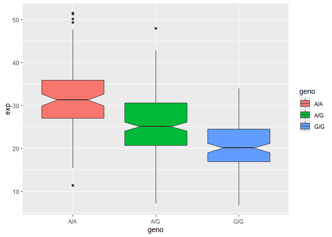

# class 17- Introduction to Genome Informatics Lab
Rachel Galleta (A16859649)

# section 1. Proportion on G/G in a population

downloaded a CSV file from Esemble \<
https://useast.ensembl.org/Homo_sapiens/Variation/Sample?db=core;r=17:39395098-40395098;v=rs8067378;vdb=variation;vf=959672880#373531_tablePanel

here we read this CSV file.

``` r
mxl<- read.csv("373531-SampleGenotypes-Homo_sapiens_Variation_Sample_rs8067378.csv")
head(mxl)
```

      Sample..Male.Female.Unknown. Genotype..forward.strand. Population.s. Father
    1                  NA19648 (F)                       A|A ALL, AMR, MXL      -
    2                  NA19649 (M)                       G|G ALL, AMR, MXL      -
    3                  NA19651 (F)                       A|A ALL, AMR, MXL      -
    4                  NA19652 (M)                       G|G ALL, AMR, MXL      -
    5                  NA19654 (F)                       G|G ALL, AMR, MXL      -
    6                  NA19655 (M)                       A|G ALL, AMR, MXL      -
      Mother
    1      -
    2      -
    3      -
    4      -
    5      -
    6      -

``` r
table(mxl$Genotype..forward.strand.)
```


    A|A A|G G|A G|G 
     22  21  12   9 

``` r
table(mxl$Genotype..forward.strand.) / nrow(mxl) * 100
```


        A|A     A|G     G|A     G|G 
    34.3750 32.8125 18.7500 14.0625 

Now lets look at a different population, I picked the GBR.

``` r
gbr<- read.csv("373522-SampleGenotypes-Homo_sapiens_Variation_Sample_rs8067378.csv")
```

find the prportion of G/G

``` r
round (table(gbr$Genotype..forward.strand.) / nrow(gbr) * 100,2 )
```


      A|A   A|G   G|A   G|G 
    25.27 18.68 26.37 29.67 

this variant that is associated with childhood asthma is more frequent
in the GBR population than MKL population.

Lets now dig into this further.

## Section 4: Population Scale Analysis

One sample is obviously not enough to know what is happening in a
population. You are interested in assessing genetic differences on a
population scale. So, you processed about ~230 samples and did the
normalization on a genome level. Now, you want to find whether there is
any association of the 4 asthma-associated SNPs (rs8067378…) on ORMDL3
expression.

How many samples do we have?

``` r
expr<- read.table("rs8067378_ENSG00000172057.6.txt")
head(expr)
```

       sample geno      exp
    1 HG00367  A/G 28.96038
    2 NA20768  A/G 20.24449
    3 HG00361  A/A 31.32628
    4 HG00135  A/A 34.11169
    5 NA18870  G/G 18.25141
    6 NA11993  A/A 32.89721

``` r
nrow(expr)
```

    [1] 462

``` r
table(expr$geno)
```


    A/A A/G G/G 
    108 233 121 

``` r
library(ggplot2)
```

    Warning: package 'ggplot2' was built under R version 4.4.3

lets make a boxplot

``` r
ggplot(expr)+ aes(geno, exp, fill=geno)+
  geom_boxplot(notch=TRUE)
```



what could you infer from the relative expression value between A/A and
G/G displayed in this plot? Does the SNP effect the expression of
ORMDL3?

A/A has the highest median expression, and G/G is the lowest. The SNP
affects ORMDL3 expression because the expression difference between A
and G is really different.
