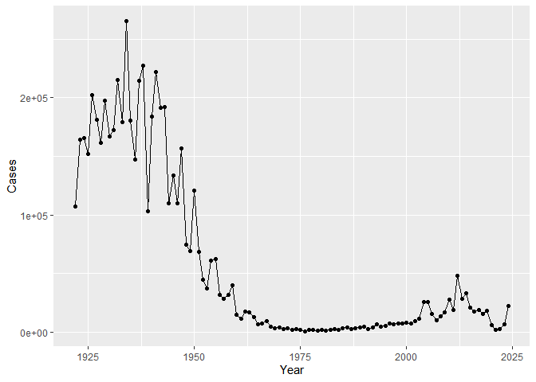
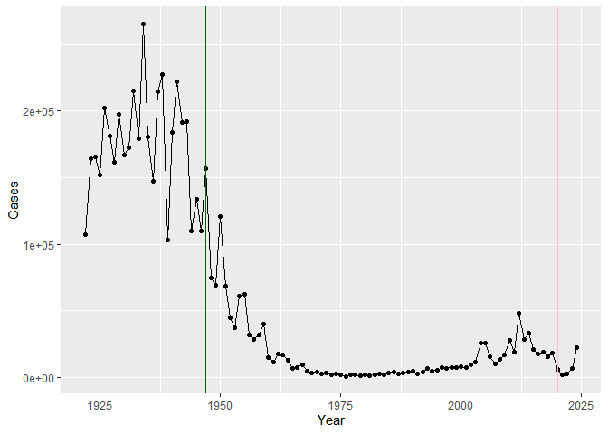
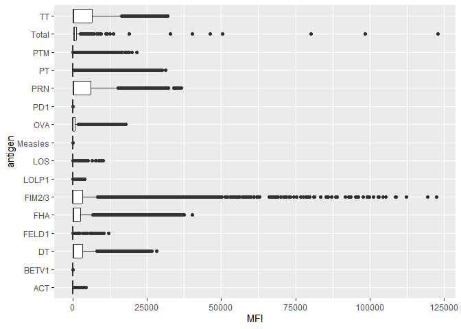
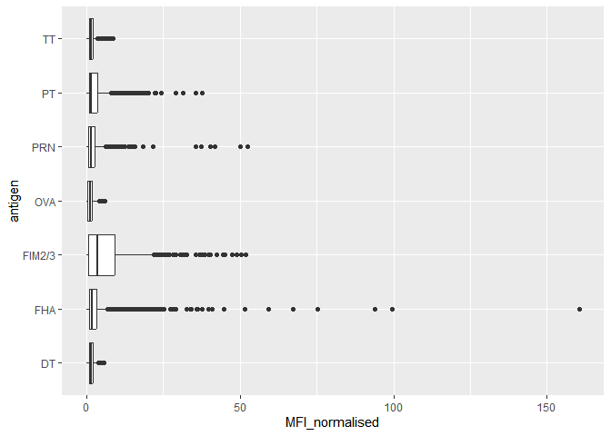
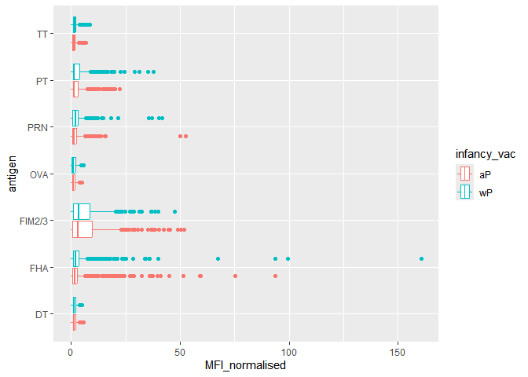
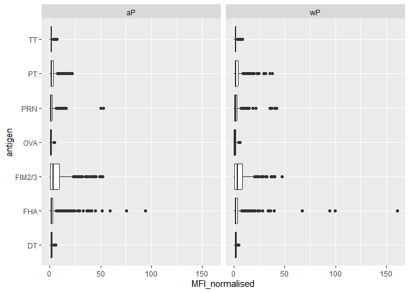
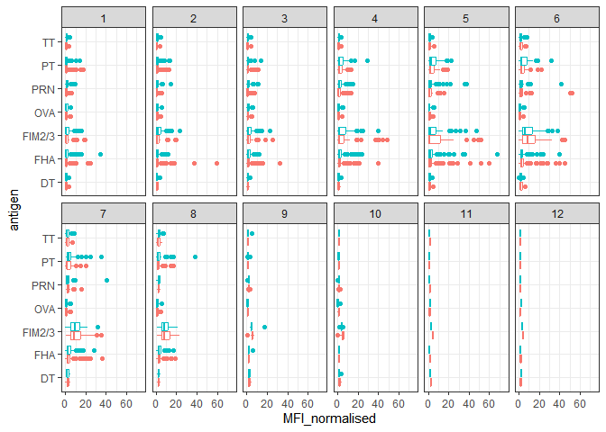
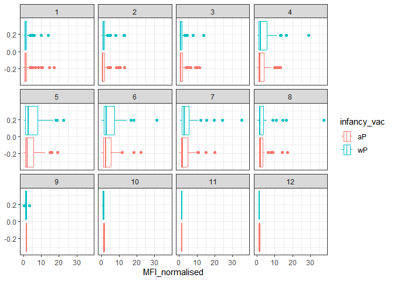
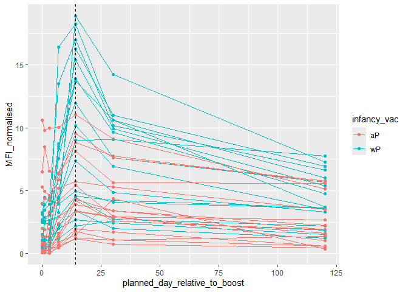

# Class 19: Pertussis Mini Project
Rachel Galleta (A16859649)

## Background

Pertussis is a bacteria; lung infection also known as Whooping
cough.Lets begin by examining CDC reported case numbers in the US:

``` r
cdc <- data.frame(

  Year = c(1922L,1923L,1924L,1925L,
                                          1926L,1927L,1928L,1929L,1930L,1931L,
                                          1932L,1933L,1934L,1935L,1936L,
                                          1937L,1938L,1939L,1940L,1941L,1942L,
                                          1943L,1944L,1945L,1946L,1947L,
                                          1948L,1949L,1950L,1951L,1952L,
                                          1953L,1954L,1955L,1956L,1957L,1958L,
                                          1959L,1960L,1961L,1962L,1963L,
                                          1964L,1965L,1966L,1967L,1968L,1969L,
                                          1970L,1971L,1972L,1973L,1974L,
                                          1975L,1976L,1977L,1978L,1979L,1980L,
                                          1981L,1982L,1983L,1984L,1985L,
                                          1986L,1987L,1988L,1989L,1990L,
                                          1991L,1992L,1993L,1994L,1995L,1996L,
                                          1997L,1998L,1999L,2000L,2001L,
                                          2002L,2003L,2004L,2005L,2006L,2007L,
                                          2008L,2009L,2010L,2011L,2012L,
                                          2013L,2014L,2015L,2016L,2017L,2018L,
                                          2019L,2020L,2021L,2022L,2023L,2024L),


  Cases = c(107473,164191,165418,152003,
                                        202210,181411,161799,197371,
                                          166914,172559,215343,179135,265269,
                                          180518,147237,214652,227319,103188,
                                          183866,222202,191383,191890,109873,
                                          133792,109860,156517,74715,69479,
                                          120718,68687,45030,37129,60886,
                                          62786,31732,28295,32148,40005,
                                          14809,11468,17749,17135,13005,6799,
                                          7717,9718,4810,3285,4249,3036,
                                          3287,1759,2402,1738,1010,2177,2063,
                                          1623,1730,1248,1895,2463,2276,
                                          3589,4195,2823,3450,4157,4570,
                                          2719,4083,6586,4617,5137,7796,6564,
                                          7405,7298,7867,7580,9771,11647,
                                          25827,25616,15632,10454,13278,
                                          16858,27550,18719,48277,28639,32971,
                                          20762,17972,18975,15609,18617,
                                          6124,2116,3044,7063,22538))
```

Plot of cases per year for pertussis in the US.

``` r
library(ggplot2)
```

    Warning: package 'ggplot2' was built under R version 4.4.3

``` r
ggplot(cdc)+
  aes(Year,Cases)+
  geom_point()+
  geom_line()
```



Add some major milestone timepoints to out plot

``` r
ggplot(cdc)+
  aes(Year,Cases)+
  geom_point()+
  geom_line()+
  geom_vline(xintercept=1947,col="darkgreen")+
  geom_vline(xintercept=1996,col="red")+
  geom_vline(xintercept=2020,col="pink")
```



The full introduction of mandatory wP (whole-cell Pertussis immunization
in the mid 1940s lead to a dramatic reduction in case numbers (from over
200,000 to 100s)

The switch to the aP (newer acellular) formalization will result in less
side effects of the drug. There two types of vaccines DTap and Tdap

The 2020 lock-downs and social distancing measures helped decrease the
number of cases.

## The CMI-BP project

The mission of CMI-PB is to provide the scientific community with a
comprehensive, high-quality and freely accessible resource of Pertussis
booster vaccination. website:https://www.cmi-pb.org/

They make their data available via JSON format API endpoints- basically
database tables in a key:values type format like “infancy_vac”:“wp” to
read this we an use the `read_json()` function form the **jsonlite**
packages.

``` r
library(jsonlite)
```

    Warning: package 'jsonlite' was built under R version 4.4.3

``` r
subject<- read_json(path="https://www.cmi-pb.org/api/v5_1/subject",simplifyVector = TRUE)

head(subject)
```

      subject_id infancy_vac biological_sex              ethnicity  race
    1          1          wP         Female Not Hispanic or Latino White
    2          2          wP         Female Not Hispanic or Latino White
    3          3          wP         Female                Unknown White
    4          4          wP           Male Not Hispanic or Latino Asian
    5          5          wP           Male Not Hispanic or Latino Asian
    6          6          wP         Female Not Hispanic or Latino White
      year_of_birth date_of_boost      dataset
    1    1986-01-01    2016-09-12 2020_dataset
    2    1968-01-01    2019-01-28 2020_dataset
    3    1983-01-01    2016-10-10 2020_dataset
    4    1988-01-01    2016-08-29 2020_dataset
    5    1991-01-01    2016-08-29 2020_dataset
    6    1988-01-01    2016-10-10 2020_dataset

> Q. how many “subjects”/individuals are in this dataset?

``` r
nrow(subject)
```

    [1] 172

> Q. how many wP and aP subjects are these?

``` r
table(subject$infancy_vac)
```


    aP wP 
    87 85 

> Q. What is the breakdown by “biological_sex” and “race”?

``` r
table(subject$biological_sex)
```


    Female   Male 
       112     60 

``` r
table(subject$race)
```


                American Indian/Alaska Native 
                                            1 
                                        Asian 
                                           44 
                    Black or African American 
                                            5 
                           More Than One Race 
                                           19 
    Native Hawaiian or Other Pacific Islander 
                                            2 
                      Unknown or Not Reported 
                                           21 
                                        White 
                                           80 

``` r
table(subject$race,subject$biological_sex)
```

                                               
                                                Female Male
      American Indian/Alaska Native                  0    1
      Asian                                         32   12
      Black or African American                      2    3
      More Than One Race                            15    4
      Native Hawaiian or Other Pacific Islander      1    1
      Unknown or Not Reported                       14    7
      White                                         48   32

This breakdown is not particulary representative of the US
population-This is a serious cavet for this study. However, its still
the largest sample of its type every assembled.

``` r
specimen<- read_json("https://www.cmi-pb.org/api/v5_1/specimen", simplifyVector=T)
ab_titer<- read_json("https://www.cmi-pb.org/api/v5_1/plasma_ab_titer", simplifyVector=T)
```

``` r
head(specimen)
```

      specimen_id subject_id actual_day_relative_to_boost
    1           1          1                           -3
    2           2          1                            1
    3           3          1                            3
    4           4          1                            7
    5           5          1                           11
    6           6          1                           32
      planned_day_relative_to_boost specimen_type visit
    1                             0         Blood     1
    2                             1         Blood     2
    3                             3         Blood     3
    4                             7         Blood     4
    5                            14         Blood     5
    6                            30         Blood     6

we need to “join” or link these tables with the `subject` table so we
can begin to analyze this data and know who give Ab sample was collected
for and when.

``` r
library(dplyr)
```

    Warning: package 'dplyr' was built under R version 4.4.3


    Adjuntando el paquete: 'dplyr'

    The following objects are masked from 'package:stats':

        filter, lag

    The following objects are masked from 'package:base':

        intersect, setdiff, setequal, union

``` r
meta<- inner_join(subject, specimen)
```

    Joining with `by = join_by(subject_id)`

``` r
head(meta)
```

      subject_id infancy_vac biological_sex              ethnicity  race
    1          1          wP         Female Not Hispanic or Latino White
    2          1          wP         Female Not Hispanic or Latino White
    3          1          wP         Female Not Hispanic or Latino White
    4          1          wP         Female Not Hispanic or Latino White
    5          1          wP         Female Not Hispanic or Latino White
    6          1          wP         Female Not Hispanic or Latino White
      year_of_birth date_of_boost      dataset specimen_id
    1    1986-01-01    2016-09-12 2020_dataset           1
    2    1986-01-01    2016-09-12 2020_dataset           2
    3    1986-01-01    2016-09-12 2020_dataset           3
    4    1986-01-01    2016-09-12 2020_dataset           4
    5    1986-01-01    2016-09-12 2020_dataset           5
    6    1986-01-01    2016-09-12 2020_dataset           6
      actual_day_relative_to_boost planned_day_relative_to_boost specimen_type
    1                           -3                             0         Blood
    2                            1                             1         Blood
    3                            3                             3         Blood
    4                            7                             7         Blood
    5                           11                            14         Blood
    6                           32                            30         Blood
      visit
    1     1
    2     2
    3     3
    4     4
    5     5
    6     6

Now lets join the `ab_titer` table with our `meta` table so we have all
information about given Ab measurements

``` r
ab_data<- inner_join(meta,ab_titer)
```

    Joining with `by = join_by(specimen_id)`

``` r
head(ab_titer)
```

      specimen_id isotype is_antigen_specific antigen        MFI MFI_normalised
    1           1     IgE               FALSE   Total 1110.21154       2.493425
    2           1     IgE               FALSE   Total 2708.91616       2.493425
    3           1     IgG                TRUE      PT   68.56614       3.736992
    4           1     IgG                TRUE     PRN  332.12718       2.602350
    5           1     IgG                TRUE     FHA 1887.12263      34.050956
    6           1     IgE                TRUE     ACT    0.10000       1.000000
       unit lower_limit_of_detection
    1 UG/ML                 2.096133
    2 IU/ML                29.170000
    3 IU/ML                 0.530000
    4 IU/ML                 6.205949
    5 IU/ML                 4.679535
    6 IU/ML                 2.816431

> Q. How many Ab measurements do we have in total?

``` r
nrow(ab_data)
```

    [1] 61956

> Q. how many different isotypes (types of Ab)?

``` r
unique(ab_data$isotype)
```

    [1] "IgE"  "IgG"  "IgG1" "IgG2" "IgG3" "IgG4"

> Q. How many different antigens?

``` r
unique(ab_data$antigen)
```

     [1] "Total"   "PT"      "PRN"     "FHA"     "ACT"     "LOS"     "FELD1"  
     [8] "BETV1"   "LOLP1"   "Measles" "PTM"     "FIM2/3"  "TT"      "DT"     
    [15] "OVA"     "PD1"    

``` r
ggplot(ab_data)+
  aes(MFI,antigen)+
  geom_boxplot()
```

    Warning: Removed 1 row containing non-finite outside the scale range
    (`stat_boxplot()`).



\##Examine IgG Ab titer levels

IgG is crucial for long-term immunity and responding to bacterial and
viral infections

``` r
igg<-ab_data|>
  filter(isotype=="IgG")
```

``` r
ggplot(igg)+
  aes(MFI_normalised,antigen)+
  geom_boxplot()
```



we can “facet” out plot by wP vs aP

``` r
ggplot(igg)+
  aes(MFI_normalised,antigen, col=infancy_vac)+
  geom_boxplot()
```



``` r
ggplot(igg)+
  aes(MFI_normalised,antigen)+
  geom_boxplot()+
  facet_wrap(~infancy_vac)
```



``` r
ggplot(igg) +
  aes(MFI_normalised, antigen, col=infancy_vac ) +
  geom_boxplot(show.legend = FALSE) + 
  facet_wrap(vars(visit), nrow=2) +
  xlim(0,75) +
  theme_bw()
```

    Warning: Removed 5 rows containing non-finite outside the scale range
    (`stat_boxplot()`).



more advanced analysis digging into individual antigen response over
time:

``` r
filter(igg,antigen=="PT") |>
  ggplot() +
  aes(MFI_normalised, col=infancy_vac) + 
  geom_boxplot(show.legend = ) + 
  facet_wrap(vars(visit))+
  theme_bw()
```



``` r
 filter(igg,  antigen == "PT", dataset =="2021_dataset")|>
  ggplot() +
    aes(x=planned_day_relative_to_boost,
        y=MFI_normalised,
        col=infancy_vac,
        group=subject_id) +
    geom_point() +
    geom_line() +
    geom_vline(xintercept=14, linetype="dashed") 
```



This plot shows the time course of pertussis toxin(PT) antibody
responses for a large set of wP (teal color) and aP(red color)
individuals. levels peak at day 14 and are larger in magnitude for wP
than aP individuals.

There are lost of cool things to explore in this dataset and we need
codding and biology knowledge do do it effectively.
